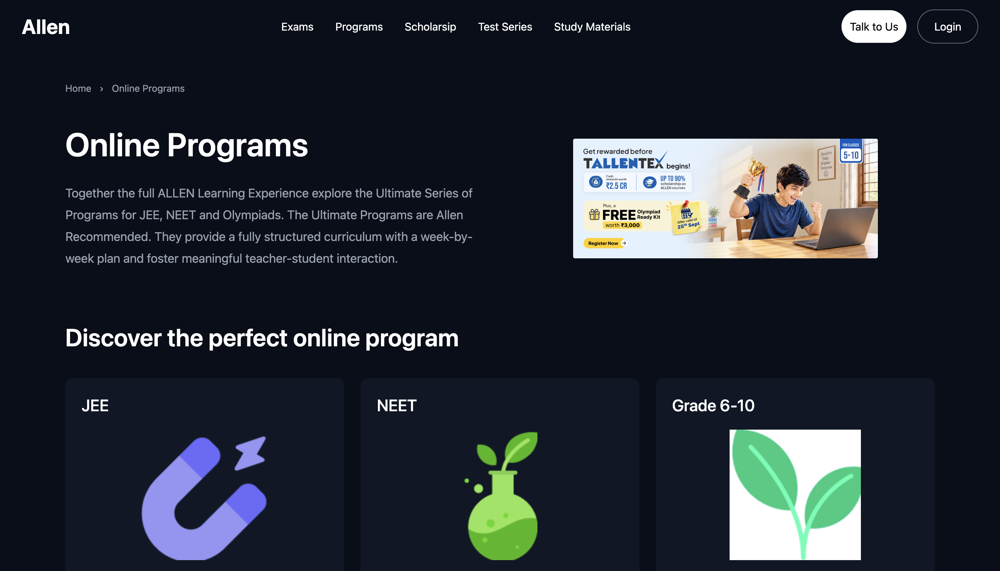

# ALLEN Online Programs — React

A responsive React-based recreation of an online education programs page, inspired by the layout and design of the ALLEN website.

The project was built from scratch to practice React component architecture, reusable components, Tailwind CSS, responsive layouts, and client-side routing





## 🚀 Features

- Responsive navigation bar
- Hero section with responsive layout
- Online programs section
- Reusable `ProgramCard` component
- Dynamic program cards using JavaScript `.map()`
- React props for reusable components
- React Router for client-side navigation
- Responsive grid layout
- Hover effects and transitions
- Local image assets

## 🛠️ Tech Stack

- React
- Vite
- Tailwind CSS
- React Router DOM
- JavaScript (ES6+)

## 📁 Project Structure

```text
src/
├── assets/
│   ├── hero.png
│   ├── JEE.png
│   ├── NEET.png
│   └── CLASS.png
│
├── components/
│   ├── Navbar.jsx
│   ├── ProgramCard.jsx
│   └── Footer.jsx
│
├── pages/
│   ├── Home.jsx
│   ├── Programs.jsx
│   ├── JEE.jsx
│   └── NEET.jsx
│
├── App.jsx
├── main.jsx
└── index.css# Allen-Frontend
